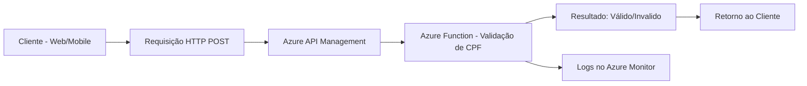
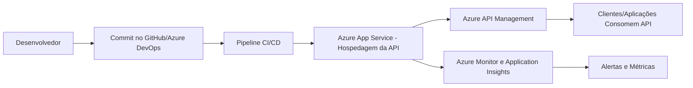

# dio-az204

## Microsserviço Serverless de Validação de CPF

## Cenário do Projeto

Este projeto tem como objetivo desenvolver um microsserviço de validação de CPFs que seja eficiente, escalável e econômico. Em um mundo digital, a validação de documentos é uma etapa crítica para a segurança e a integridade de qualquer sistema. A criação de um serviço dedicado para essa tarefa, utilizando uma arquitetura serverless, permite que a aplicação se adapte dinamicamente à demanda, garantindo alta disponibilidade e minimizando os custos operacionais.

---

## Objetivos do Projeto

O desenvolvimento deste microsserviço é guiado pelos seguintes objetivos principais:

* **Validação Confiável:** Criar uma lógica robusta e precisa para a validação de CPFs brasileiros, seguindo as regras oficiais do algoritmo de verificação.  
* **Eficiência e Desempenho:** Garantir que o serviço responda rapidamente às solicitações, sem a necessidade de manter servidores sempre ativos.  
* **Escalabilidade e Custo-Benefício:** Utilizar uma arquitetura serverless para que o serviço escale automaticamente em picos de demanda e não gere custos em períodos de inatividade.  
* **Fácil Manutenção:** Projetar o microsserviço de forma modular e clara, facilitando a manutenção e a adição de novas funcionalidades no futuro.  

---

## Tecnologias e Arquitetura

A arquitetura do projeto é centrada em serviços serverless da Microsoft Azure, que oferecem a infraestrutura necessária para alcançar nossos objetivos de forma eficiente.

* **Azure Functions:** A espinha dorsal do projeto. Uma função de gatilho HTTP será utilizada para receber as requisições de validação de CPF. A lógica de validação será contida nesta função, que só é executada quando solicitada.  
* **Azure API Management:** Utilizado como um gateway de API para gerenciar as requisições, aplicar políticas de segurança e monitorar o tráfego do serviço.  
* **Azure Monitor:** Ferramenta essencial para o monitoramento de desempenho e o rastreamento de logs da função, permitindo identificar e resolver problemas rapidamente.  

---

## Como o Serviço Funciona

O fluxo de trabalho do serviço é simples e direto:

1. Um cliente (aplicação web, mobile, etc.) envia uma requisição **HTTP POST** contendo o CPF a ser validado para o endpoint da API.  
2. A requisição é recebida pelo **Azure API Management**, que a roteia para a **Azure Function**.  
3. A **Azure Function** é ativada e executa a lógica de validação do CPF.  
4. O resultado (**válido/inválido**) é retornado ao cliente.  

Todo o processo é executado em um ambiente **serverless**, o que significa que não há servidores para gerenciar e o custo está diretamente atrelado ao número de execuções. Este modelo de microsserviço é ideal para a validação de dados, onde a demanda pode variar drasticamente.  

---

## Fluxo Arquitetural

## Deploy de uma API na Azure

## Cenário do Projeto

Este projeto tem como objetivo demonstrar como realizar o deploy de uma API de forma eficiente e escalável na **Microsoft Azure**. APIs são componentes essenciais em sistemas modernos, pois permitem a comunicação entre aplicações, serviços e dispositivos. Utilizar os recursos da Azure para hospedar e gerenciar uma API garante alta disponibilidade, segurança, escalabilidade e facilidade de manutenção, sem a necessidade de infraestrutura física dedicada.

---

## Objetivos do Projeto

O desenvolvimento e deploy desta API foram guiados pelos seguintes objetivos:

* **Disponibilidade:** Garantir que a API esteja sempre acessível, com alta resiliência e redundância.  
* **Escalabilidade:** Permitir que a aplicação se adapte automaticamente a variações de carga, atendendo desde poucos até milhares de usuários simultâneos.  
* **Segurança:** Proteger os endpoints da API com autenticação, autorização e políticas de segurança adequadas.  
* **Gerenciamento Simplificado:** Utilizar ferramentas da Azure que facilitam o monitoramento, versionamento e manutenção da API.  
* **Integração Contínua:** Automatizar o processo de deploy utilizando pipelines de CI/CD.  

---

## Tecnologias e Arquitetura

A arquitetura proposta combina os seguintes serviços da Azure:

* **Azure App Service:** Serviço principal de hospedagem da API, com suporte a várias linguagens (Python, Node.js, .NET, Java etc.).  
* **Azure API Management:** Camada de gerenciamento para expor, proteger e monitorar os endpoints da API.  
* **Azure DevOps ou GitHub Actions:** Ferramentas para automação do processo de integração contínua e entrega contínua (CI/CD).  
* **Azure Monitor e Application Insights:** Serviços de monitoramento para métricas, logs e alertas sobre o desempenho da API.  

---

## Como o Deploy Funciona

O fluxo de deploy e uso da API segue os seguintes passos:

1. O desenvolvedor realiza commits do código da API em um repositório GitHub ou Azure DevOps.  
2. Um pipeline de **CI/CD** é acionado, executando testes automatizados e build da aplicação.  
3. Após os testes, o código é implantado automaticamente no **Azure App Service**.  
4. O **Azure API Management** gerencia os endpoints da API, aplicando autenticação, limites de uso e métricas de consumo.  
5. Usuários ou aplicações clientes acessam a API através do endpoint exposto.  
6. Logs e métricas de desempenho são armazenados no **Azure Monitor** e **Application Insights** para acompanhamento contínuo.  

---

## Fluxo Arquitetural

---

## Próximos Passos e Oportunidades de Expansão

* **Escalabilidade Avançada:** Configurar regras de auto scale no Azure App Service para ajustar automaticamente os recursos com base na demanda.  
* **Segurança Aprimorada:** Adicionar autenticação baseada em OAuth 2.0 e integração com o **Azure Active Directory**.  
* **Observabilidade:** Criar dashboards personalizados no Power BI ou Grafana a partir dos dados coletados pelo Azure Monitor.  
* **Expansão Multi-Região:** Implantar a API em diferentes regiões da Azure para reduzir latência e aumentar a disponibilidade global.  

