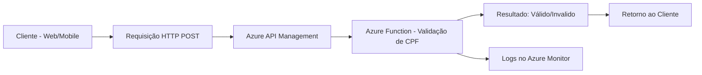

# dio-az204

## Microsserviço Serverless de Validação de CPF

## Cenário do Projeto

Este projeto tem como objetivo desenvolver um microsserviço de validação de CPFs que seja eficiente, escalável e econômico. Em um mundo digital, a validação de documentos é uma etapa crítica para a segurança e a integridade de qualquer sistema. A criação de um serviço dedicado para essa tarefa, utilizando uma arquitetura serverless, permite que a aplicação se adapte dinamicamente à demanda, garantindo alta disponibilidade e minimizando os custos operacionais.

---

## Objetivos do Projeto

O desenvolvimento deste microsserviço é guiado pelos seguintes objetivos principais:

* **Validação Confiável:** Criar uma lógica robusta e precisa para a validação de CPFs brasileiros, seguindo as regras oficiais do algoritmo de verificação.  
* **Eficiência e Desempenho:** Garantir que o serviço responda rapidamente às solicitações, sem a necessidade de manter servidores sempre ativos.  
* **Escalabilidade e Custo-Benefício:** Utilizar uma arquitetura serverless para que o serviço escale automaticamente em picos de demanda e não gere custos em períodos de inatividade.  
* **Fácil Manutenção:** Projetar o microsserviço de forma modular e clara, facilitando a manutenção e a adição de novas funcionalidades no futuro.  

---

## Tecnologias e Arquitetura

A arquitetura do projeto é centrada em serviços serverless da Microsoft Azure, que oferecem a infraestrutura necessária para alcançar nossos objetivos de forma eficiente.

* **Azure Functions:** A espinha dorsal do projeto. Uma função de gatilho HTTP será utilizada para receber as requisições de validação de CPF. A lógica de validação será contida nesta função, que só é executada quando solicitada.  
* **Azure API Management:** Utilizado como um gateway de API para gerenciar as requisições, aplicar políticas de segurança e monitorar o tráfego do serviço.  
* **Azure Monitor:** Ferramenta essencial para o monitoramento de desempenho e o rastreamento de logs da função, permitindo identificar e resolver problemas rapidamente.  

---

## Como o Serviço Funciona

O fluxo de trabalho do serviço é simples e direto:

1. Um cliente (aplicação web, mobile, etc.) envia uma requisição **HTTP POST** contendo o CPF a ser validado para o endpoint da API.  
2. A requisição é recebida pelo **Azure API Management**, que a roteia para a **Azure Function**.  
3. A **Azure Function** é ativada e executa a lógica de validação do CPF.  
4. O resultado (**válido/inválido**) é retornado ao cliente.  

Todo o processo é executado em um ambiente **serverless**, o que significa que não há servidores para gerenciar e o custo está diretamente atrelado ao número de execuções. Este modelo de microsserviço é ideal para a validação de dados, onde a demanda pode variar drasticamente.  

---

## Fluxo Arquitetural

